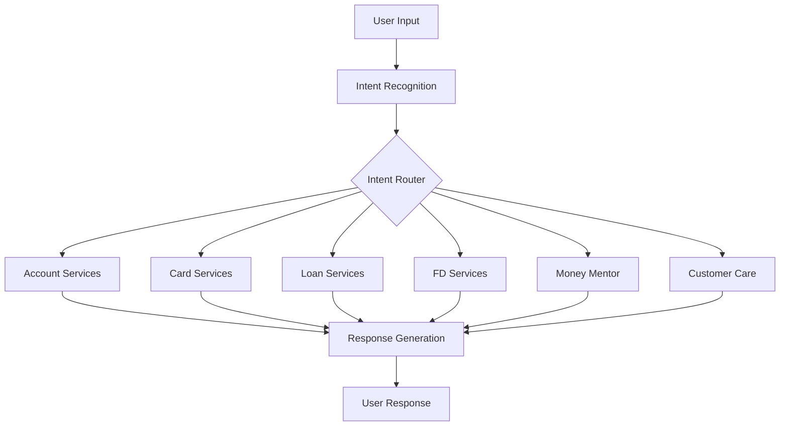

# 🏦 BankBuddy: Your Intelligent Banking Assistant 🤖


## 📋 Overview

BankBuddy is an intelligent banking assistant designed to provide seamless customer support for banking services. Built with Google's Dialogflow CX and powered by Gemini Pro LLM, this conversational AI assistant helps users with account information, card services, loans, fixed deposits, and financial advice.

## ✨ Features

### 🏦 Banking Services
- **💰 Account Information** - Check balances, transaction history, and account details
- **💳 Card Services** - Card activation, blocking, limit management, and statement requests
- **💸 Loan Services** - Loan inquiries, application process, and EMI calculations
- **📈 Fixed Deposits** - FD creation, rates, and maturity information
- **🎁 Offers & Promotions** - Latest banking offers and promotions

### 💡 Financial Advisory
- **💹 Money Mentor** - Personalized financial advice and budgeting tips
- **📊 Spending Analysis** - Insights into spending habits and patterns

### 🛠️ Technical Capabilities
- **🌐 Multilingual Support** - Available in 9 languages (English, Hindi, Gujarati, Marathi, and various English dialects)
- **🎯 Advanced Intent Recognition** - Accurately understands user requests
- **🧠 AI-Powered Responses** - Gemini Pro LLM for natural conversations
- **🔊 Voice Recognition** - Speech adaptation for improved accuracy
- **🔄 Seamless Conversation Flows** - Well-structured conversation paths for different services

## 🔍 Architecture



## 🧩 Components

| Component | Description |
|-----------|-------------|
| **Intents** | Define what users want to accomplish (Account Info, Cards, Loans, etc.) |
| **Entity Types** | Extract specific information from user inputs (numbers, phone numbers, spending habits) |
| **Flows** | Guide conversation paths for different services |
| **Webhooks** | Connect to external systems for real-time data |
| **Generative Settings** | Configure LLM responses (using Gemini Pro) |

## 🌐 Supported Languages

- English (en, en-in, en-us, en-gb, en-ca, en-au)
- Hindi (hi)
- Gujarati (gu)
- Marathi (mr, mr-in)

## 🛣️ Conversation Flows

BankBuddy implements sophisticated conversation flows for each service category:

- **Authentication Flow** - Secure user verification
- **Account Information Flow** - Balance inquiries, transaction history
- **Card Services Flow** - Card management and support
- **Loan Services Flow** - Loan information and applications
- **Fixed Deposit Flow** - FD creation and management
- **Customer Care Flow** - Connecting with human agents when needed

## 🚀 Getting Started

To deploy and customize BankBuddy for your banking institution:

1. **Clone this repository**
   ```bash
   git clone https://github.com/Yash-Kavaiya/BankBuddy.git
   ```

2. **Import into Dialogflow CX**
   - Navigate to Dialogflow CX Console
   - Create a new agent
   - Import the agent configuration from the cloned repository

3. **Configure Webhooks**
   - Update webhook configurations to connect with your banking systems
   - Set up authentication for secure data access

4. **Customize Responses**
   - Adjust response templates to match your brand voice
   - Modify flows to accommodate your specific banking products

## 📊 Performance Monitoring

BankBuddy includes built-in logging for performance monitoring:
- Conversation logs for quality analysis
- Speech adaptation metrics
- Intent recognition accuracy

## 🔒 Security Features

- Secure authentication flows
- Phone number verification
- Privacy-focused conversation design

## 🌟 Future Enhancements

- Integration with payment gateways
- Advanced transaction analytics
- Personalized financial insights
- Investment advisory services

---

⭐ Star this repository if you find it useful!

📝 For issues and feature requests, please create a new issue.

🏆 Developed by [Yash Kavaiya](https://github.com/Yash-Kavaiya)
